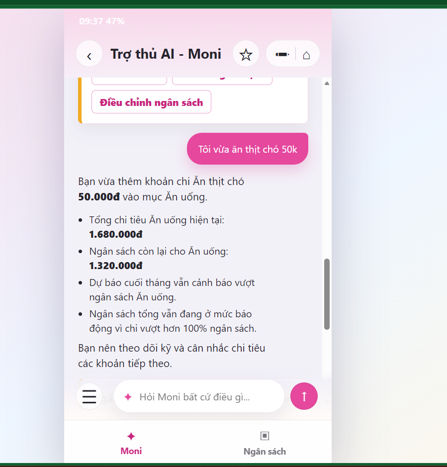
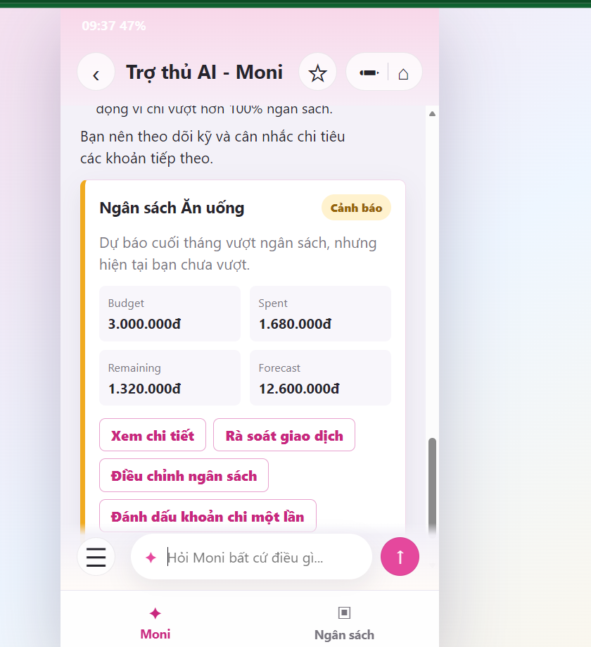
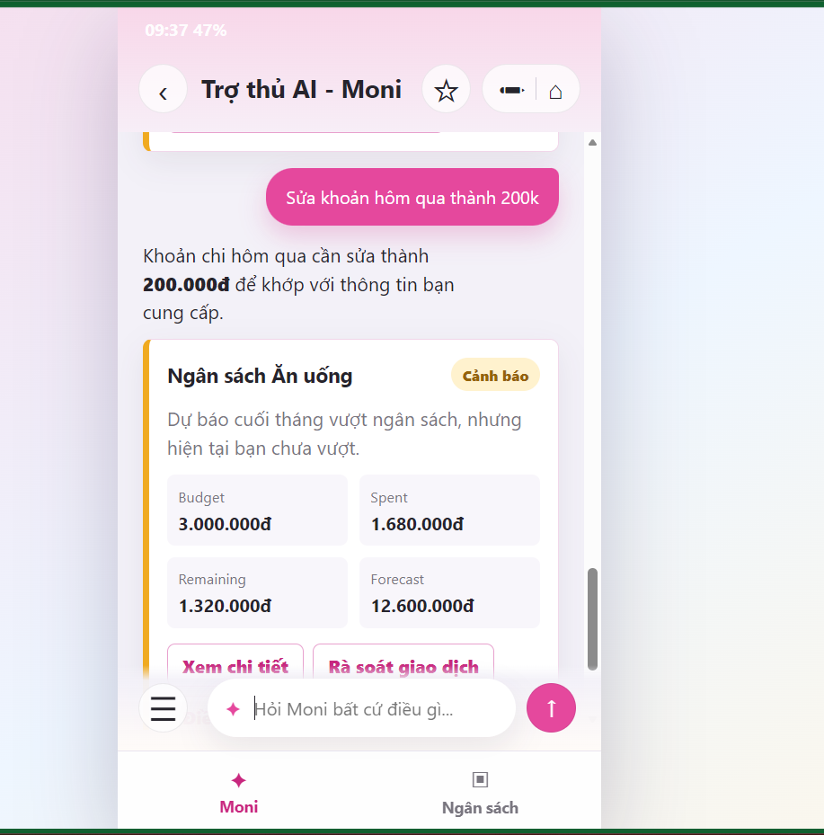
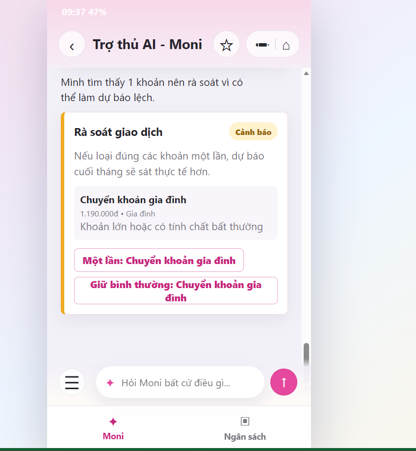
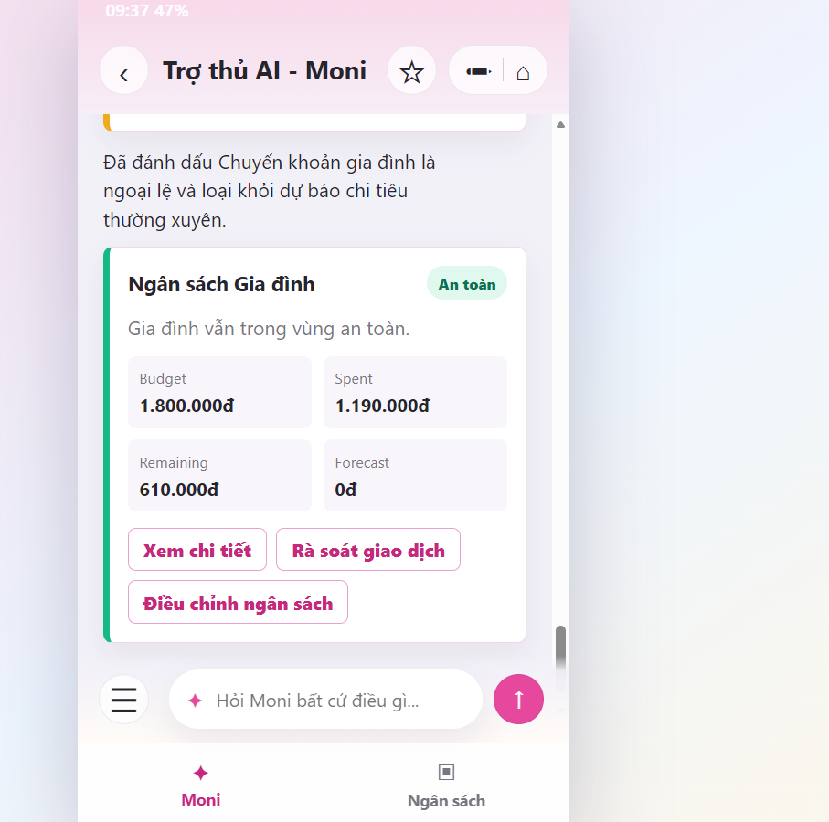

# SPEC sản phẩm - Moni Budget Copilot

## 1. Bằng chứng

**Track:** Personal Finance / Fintech  
**Product tham chiếu:** MoMo - Moni  
**User chính:** Người dùng MoMo có thu nhập cố định hằng tháng, thanh toán hằng ngày qua ví điện tử và muốn kiểm soát ngân sách để không tiêu quá khả năng tài chính.

### Evidence summary

| Bằng chứng | Nguồn | Pain nói lên điều gì? | Quyết định SPEC |
|---|---|---|---|
| Khi tự dùng Moni, user ghi thêm khoản `ăn tối 80k`; Moni nhận diện được khoản chi và danh mục nhưng không chủ động cảnh báo dù context test cho thấy ngân sách đã xấu đi. | Self-use Moni trong evidence pack | Moni có dữ liệu giao dịch nhưng chưa biến giao dịch mới thành cảnh báo ngân sách kịp thời. | Prototype phải tính lại ngân sách sau mỗi giao dịch và cảnh báo khi sắp vượt hoặc đã vượt. |
| Review Google Play: "Phần quản lý chi tiêu hơi kém, dù đã vượt mức ngân sách vẫn không có cảnh báo." | Review công khai ngày 03/06/2026 | Pain không chỉ là xem lại đã chi bao nhiêu, mà là thiếu cảnh báo chủ động khi chi tiêu lệch kế hoạch. | Tập trung vào cảnh báo sớm, forecast cuối tháng và next action cụ thể. |
| App teardown cá nhân cho thấy Moni làm tốt các truy vấn đơn giản, nhưng query phức tạp có rủi ro thiếu source hoặc thiếu nhất quán. | App teardown cá nhân | Với dữ liệu tài chính, user cần tin được con số trước khi đổi hành vi. | Mọi số liệu phải đến từ tool/backend, có budget, spent, remaining, forecast và trạng thái rõ ràng. |

**Insight:** User không chỉ cần xem lại lịch sử chi tiêu. Họ cần biết sớm tốc độ chi hiện tại có làm vượt ngân sách tháng hay không, vì nếu chỉ phát hiện khi đã tiêu quá nhiều thì rất khó điều chỉnh phần còn lại của tháng.

## 2. Lát cắt để build

Một người dùng MoMo đặt ngân sách tháng **10.000.000đ**. Khi họ thêm, sửa hoặc rà soát giao dịch trong chat, Moni Budget Copilot dùng AI để hiểu ý định và gọi tool phù hợp; backend/tool layer tính lại:

- Tổng đã chi trong tháng.
- Ngân sách còn lại.
- Tốc độ chi tiêu hiện tại.
- Dự báo chi tiêu cuối tháng.
- Mức rủi ro: `safe`, `warning`, `danger`, `low_confidence`.
- Action tiếp theo: xem chi tiết, rà soát giao dịch, điều chỉnh ngân sách, đánh dấu khoản chi một lần.

Prototype không cố build toàn bộ app tài chính. Lát cắt demo là: **chat-first budget copilot cảnh báo nguy cơ vượt ngân sách và cho user sửa/đánh dấu ngoại lệ để Moni tính lại forecast.**

## 3. AI Product Canvas

| Ô | Nội dung |
|---|---|
| **Value - Giá trị** | Giúp user phát hiện sớm nguy cơ vượt ngân sách, không chỉ sau khi đã tiêu quá nhiều. AI biến câu chat tự nhiên thành hành động có cấu trúc, còn tool/backend trả về số liệu đáng tin. |
| **Trust - Niềm tin** | AI không tự bịa số và không tự ghi dữ liệu tài chính khi thiếu thông tin. Mọi con số ngân sách đến từ tool result. Khi mơ hồ, Moni hỏi lại hoặc hiển thị confirmation card. |
| **Feasibility - Tính khả thi** | Prototype đã có mock data, dashboard, chat UI, tool schemas và backend endpoint `POST /api/moni/chat`. Nếu thiếu OpenAI API key, app vẫn có mock parser/tool layer để demo. |
| **Tín hiệu học** | Khi user sửa giao dịch hoặc đánh dấu khoản chi là ngoại lệ, prototype cập nhật `exceptionType`, `excludedFromForecast` và tính lại forecast. Trong bản Day 06, dữ liệu này là tín hiệu kiểm thử/correction, chưa dùng để huấn luyện dài hạn. |

## 4. Tăng năng lực hay tự động hóa

Nhóm chọn **conditional automation**.

AI được tự động làm trong phạm vi hẹp: hiểu câu chat, chọn intent/tool, tạo câu trả lời thân thiện từ kết quả tool. Backend tự động tính toán lại ngân sách, forecast và risk card sau các write tool như `addExpense`, `updateExpense`, `updateMonthlyBudget`, `updateCategoryBudget`, `markExpenseException`.

Con người vẫn giữ quyền quyết định ở các bước có rủi ro:

- Có điều chỉnh ngân sách hay không.
- Có đánh dấu khoản chi là ngoại lệ hay không.
- Chọn giao dịch nào khi câu lệnh sửa/xóa mơ hồ.
- Có tin và làm theo cảnh báo hay không.

Lý do: sai số trong app tài chính có thể làm user lo lắng hoặc ra quyết định chi tiêu sai. Vì vậy AI được dùng như forecaster/advisor, không phải người tự ý thay đổi ngân sách thay user.

## 5. Bốn đường đi của trải nghiệm

| Path | Prototype thể hiện gì? | Minh chứng |
|---|---|---|
| **Đường thuận** | User thêm khoản chi rõ ràng. Moni ghi nhận khoản chi, tính lại ngân sách danh mục, báo `Budget`, `Spent`, `Remaining`, `Forecast` và đưa action tiếp theo. |   |
| **Khi AI không chắc** | User yêu cầu sửa giao dịch mơ hồ như "Sửa khoản hôm qua thành 200k". Prototype cần tránh write sai giao dịch; khi thiếu định danh hoặc có nhiều match, Moni phải hỏi lại hoặc đưa card xác nhận trước khi sửa. |  |
| **Khi AI phát hiện rủi ro/sai lệch forecast** | Moni rà soát giao dịch bất thường có thể làm dự báo lệch, ví dụ "Chuyển khoản gia đình" 1.190.000đ. Thay vì chỉ báo chung chung, card cho user chọn giữ bình thường hoặc đánh dấu một lần. |  |
| **Khi người dùng sửa** | User đánh dấu khoản chi là ngoại lệ. Backend cập nhật trạng thái, loại khoản đó khỏi dự báo chi tiêu thường xuyên và tính lại card ngân sách về trạng thái an toàn nếu phù hợp. |  |

## 6. Những kiểu lỗi đáng lo nhất

| Failure mode | Khi nào xảy ra? | Hậu quả | Prototype xử lý |
|---|---|---|---|
| **Cảnh báo im lặng** | User thêm giao dịch làm ngân sách xấu đi nhưng Moni chỉ xác nhận đã ghi nhận. | User phát hiện quá muộn, khó điều chỉnh phần còn lại của tháng. | Sau mỗi write tool, backend gọi recalculation và tạo warning/danger card nếu cần. |
| **Forecast bị lệch vì khoản chi một lần** | Có khoản lớn như học phí, trả nợ, chuyển khoản gia đình. | User nhận cảnh báo quá nặng, mất tin tưởng vào Moni. | `reviewUnusualExpenses` tìm khoản bất thường; user có thể gọi `markExpenseException` để loại khỏi forecast. |
| **Write sai giao dịch** | User nói "sửa khoản hôm qua" nhưng hôm qua có nhiều giao dịch. | Dữ liệu tài chính bị sửa nhầm. | Low-confidence path trả confirmation card, không ghi dữ liệu cho tới khi user chọn đúng giao dịch. |

## 7. Kế hoạch kiểm thử và bằng chứng demo

### Test inputs

| Path | Input demo | Kỳ vọng |
|---|---|---|
| Happy | `Tôi vừa ăn thịt chó 50k` | Ghi thêm expense, tính lại ngân sách Ăn uống, hiển thị warning card nếu forecast vượt ngân sách. |
| Low-confidence | `Sửa khoản hôm qua thành 200k` | Nếu không đủ chắc chắn giao dịch nào cần sửa, Moni không tự sửa dữ liệu và phải yêu cầu xác nhận. |
| Failure/risk review | `Rà soát giao dịch bất thường` | Hiển thị khoản lớn có thể làm forecast lệch và đưa action "Một lần" / "Giữ bình thường". |
| Correction | Bấm `Một lần: Chuyển khoản gia đình` | Đánh dấu ngoại lệ, loại khỏi forecast thường xuyên và render card ngân sách đã tính lại. |

### Bằng chứng ảnh

- `spec/img/happy_path_1.png`
- `spec/img/happy_path_2.png`
- `spec/img/low-confident_path.png`
- `spec/img/failure_path.png`
- `spec/img/correction_path.png`

## 8. Phân công

| Thành viên | Việc phụ trách | Bằng chứng cần có |
|---|---|---|
| Trương Hải Quân - 2A202600898 | SPEC, tổng hợp repo, evidence pack | README/SPEC, assets ảnh 4 path, kịch bản trình bày |
| Bùi Minh Hiếu - 2A202600876 | Prototype UI | Chat UI, budget card, dashboard, action buttons |
| Nguyễn Sĩ Việt - 2A202600658 | Logic dự báo/tool layer | Hàm tính budget snapshot, category snapshot, risk level, exception handling |
| Trần Quang Huy - 2A202601010 | Test 4 paths và demo | Test happy/low-confidence/failure/correction, ảnh minh chứng trong `spec/img/` |

## 9. Backlog không build trong Day 06

- Kết nối dữ liệu MoMo thật.
- Tự động chặn giao dịch.
- Tự động điều chỉnh ngân sách thay user.
- Học dài hạn từ toàn bộ correction của user.
- Voice input và preview transcript.
- Phân tích lịch sử giao dịch dài hạn nhiều tháng.
